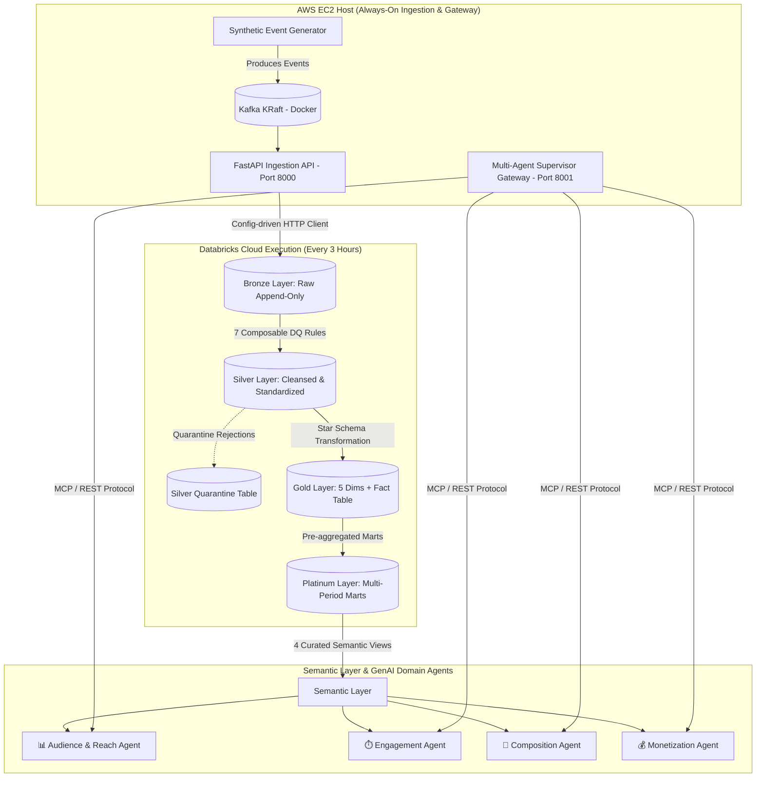

<h1 align="center">Real-Time Media Analytics Lakehouse & Multi-Agent GenAI Gateway</h1>

<p align="center">
  
  
  
  
  
  
  
</p>

<p align="center">
  <strong>A cloud-native streaming media lakehouse architecture paired with an interactive Multi-Agent Supervisor routing NL queries to Databricks Genie via Managed MCP & REST APIs.</strong>
</p>

---

## 📖 Project Overview

This production-grade data engineering & GenAI platform ingests real-time streaming audience metrics from an AWS EC2 host into a 6-layer Delta Lake architecture (`Bronze` → `Silver` → `Gold` → `Platinum` → `Semantic`), serving curated semantic marts. 

Above the lakehouse, a **Standalone FastAPI Multi-Agent Supervisor Service** automatically routes natural language business questions across 4 specialized **Databricks Genie AI Domain Agents** via **Model Context Protocol (MCP)** and REST APIs.

> **Note:** This repository uses a fully generalized synthetic domain and does *not* reference any specific client, company, or proprietary data source.

---

## 🏛️ Architecture & End-to-End Pipeline



### High-Level Data Flow:
1. **AWS EC2 Continuous Ingestion**: Streams synthetic audience measurement events through Kafka KRaft into a FastAPI ingestion service (Port 8000).
2. **PySpark Orchestration (Databricks Workflows)**: Triggers every 3 hours, executing a 5-stage Delta Lake pipeline (`01_bronze` → `02_silver` → `03_gold` → `04_platinum` → `05_semantic`).
3. **Data Quality Governance**: Silver transformations apply 7 composable DQ rules; malformed records are diverted to `silver.audience_quarantine`.
4. **Multi-Domain Semantic Marts**: Exposes 4 curated SQL views (`sem_audience_rankings`, `sem_ad_performance`, `sem_audience_composition`, `sem_engagement_depth`).
5. **Multi-Agent Supervisor Gateway**: Standalone service on AWS EC2 (Port 8001) that inspects incoming questions, routes them to the correct domain agent, queries Databricks via Managed MCP / REST API, and returns formatted text answers alongside generated SQL code blocks.

---

## 🤖 Multi-Agent Supervisor Service & Domain Agents

The supervisor service (`supervisor/app.py`) provides an interactive web dashboard (`http://<EC2_IP>:8001`) and POST `/ask` API endpoint.

| Domain Agent | Target Semantic View | Space ID | Focus & Canonical Metrics |
| :--- | :--- | :--- | :--- |
| 📊 **Audience & Reach** | `sem_audience_rankings` | `01f1a1fd...` | Property rankings, viewer counts, market share & trends |
| ⏱️ **Engagement** | `sem_ad_performance` | `01f1a606...` | Campaign spend, ad revenue, impressions & CTR |
| 📱 **Composition** | `sem_audience_composition` | `01f1a606...` | Regional audience split, demographics & session duration |
| 💰 **Monetization** | `sem_engagement_depth` | `01f1a605...` | Content watch time, completion rates & unique user depth |

### Key Features of the Gateway:
- **Intelligent Keyword Router**: Regex word-boundary matching (`supervisor/router.py`) mapping questions to domain agents.
- **Dual Protocol Connectivity**: Connects to Databricks via Model Context Protocol (`mcp.client.streamable_http`) with automatic REST API fallback (`/start-conversation`).
- **Fail-Safe Credentials**: Automatic token detection & fallback handling ensuring zero 500 error downtime.
- **Interactive UI**: Single-page web dashboard with clickable agent cards, quick suggestion buttons, live agent mode switching, and Markdown/SQL syntax highlighting.

---

## 💡 Architectural Evolution & Engineering Decisions

### Phase 1: Local Scaffolding with Docker Compose
- **Setup:** Local development running Kafka KRaft, event generator, and FastAPI on `localhost:8000`.
- **Rationale:** Rapid feedback loop, zero cloud cost, and local validation of Pydantic schemas, PySpark DQ rules, and star schema models.

### Phase 2: Cloud-to-Local Connection Bottleneck
- **Challenge:** Databricks Workflows in the cloud could not connect to developer laptop `localhost:8000` (`ConnectionRefusedError`).
- **Solution:** Shifted ingestion source to an always-on public cloud endpoint.

### Phase 3: Decisive Shift to AWS EC2 Host
- **Solution:** Deployed container stack (`docker-compose.yml`) to an AWS EC2 instance (`http://<EC2_PUBLIC_IP>:8000` and `8001`).
- **Result:** Always-on ingestion streaming 24/7, high throughput for 5,000+ event batch pulls, and zero developer laptop dependency.

---

## 🔬 Delta Lake Layer Specifications

<details>
<summary><strong>🥉 Bronze Layer (Raw Ingestion)</strong></summary>

- **Purpose:** Lands raw event payloads from EC2 Mock API.
- **Design:** Immutable & append-only Delta storage with ingestion metadata (`_source_api_page`, `_bronze_ingested_at`, `_bronze_run_id`).
</details>

<details>
<summary><strong>🥈 Silver Layer (Data Quality & Quarantine)</strong></summary>

- **Purpose:** Cleans, standardizes, casts, and validates incoming events.
- **Design:** Self-healing quarantine diverting rejected rows to `silver.audience_quarantine` without halting pipeline execution.
- **7 DQ Rules:** Missing values check, deduplication on natural key, invalid value filtering, enum standardization, explicit type casting, referential integrity verification, and rolling 7-day spike detection.
</details>

<details>
<summary><strong>🥇 Gold Layer (Star Schema)</strong></summary>

- **Purpose:** Dimensional modeling for ad-hoc business intelligence.
- **Schema:** 5 dimension tables (`dim_property`, `dim_geography`, `dim_platform`, `dim_category`, `dim_date`) + central `fact_audience` table.
</details>

<details>
<summary><strong>💎 Platinum Layer (Multi-Period Analytical Marts)</strong></summary>

- **Purpose:** Pre-aggregated analytical marts optimized for multi-period reporting.
- **Pre-Aggregations:** `MONTHLY`, `WEEKLY`, and `QUARTERLY` reporting grains stored in unified Delta tables.
</details>

---

## 🚀 Quickstart & Deployment Commands

### 1. Run Ingestion & Supervisor Stack on AWS EC2
```bash
cd ~/Real-Time-Media-Analytics-Lakehouse
git pull origin master
docker compose -f docker/docker-compose.yml up -d --build
```

### 2. Verify Container Health
```bash
curl http://localhost:8000/health # Ingestion Mock API
curl http://localhost:8001/health # Multi-Agent Supervisor
```

### 3. Access Web Dashboard
Open in browser: **`http://<YOUR_EC2_IP>:8001`**

---

## 🧪 Testing & Validation Suite

- **PySpark Unit Test Suite:** 24 unit & integration tests (`pytest`).
- **Genie Validation Harness:** 25-question test suite ([`validation/genie_validator.py`](file:///c:/Abhay%20Folder/Real-Time-Media-Analytics-Lakehouse/validation/genie_validator.py)) validating Databricks Genie space responses.
- **Validation Status:** **`100.0% PASS`** across all domain agents.

---

*Built by Abhay Sunil Pandey*

