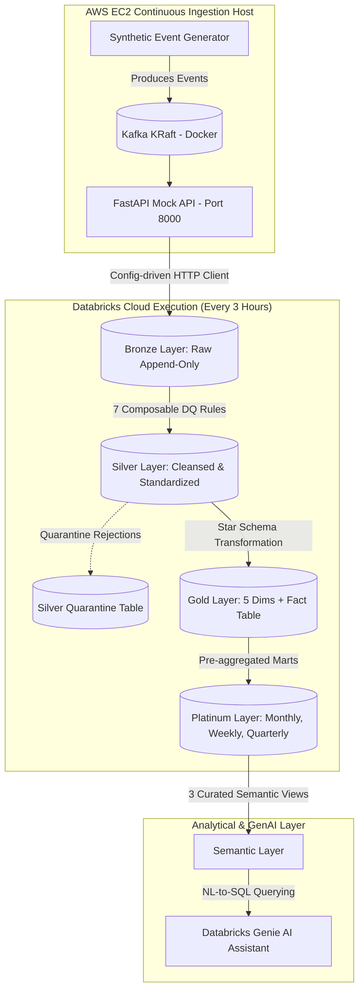

<h1 align="center">Real-Time Media Analytics Lakehouse & GenAI Assistant</h1>

<p align="center">
  
  
  
  
  
  
  
</p>

<p align="center">
  <strong>A generalized, cloud-native streaming analytics lakehouse architecture with natural language querying via Databricks Genie.</strong>
</p>

---

## 📖 Project Context

This portfolio project demonstrates an end-to-end, production-grade data engineering platform. It ingests synthetic streaming media audience metrics from an always-on cloud source into a 6-layer Delta Lake architecture, serving a curated semantic layer optimized for Natural Language-to-SQL querying via **Databricks Genie**.

**Note:** This repository uses a fully generalized synthetic domain and does *not* reference any specific client, company, or proprietary data source.

---

## 🏛️ Architecture & End-to-End Pipeline

The platform operates as a continuous cloud pipeline. The ingestion layer runs continuously on AWS EC2, and Databricks Workflows trigger scheduled batch ingestion and transformations every 3 hours:



### High-Level Data Flow:
1. **AWS EC2 (Kafka + Generator + Mock API)**: Streams continuous synthetic audience measurement events.
2. **PySpark Ingestion Job (Databricks Workflows)**: Triggers every 3 hours, pulling batches of ~5,000 events.
3. **Bronze Layer**: Appends raw API JSON payloads into immutable Delta storage.
4. **Silver Layer**: Applies 7 composable Data Quality (DQ) rules; bad data is diverted to `silver.quarantine`.
5. **Gold Layer**: Builds dimensional model (5 dimension tables + central `fact_audience` table).
6. **Platinum Layer**: Pre-computes `MONTHLY`, `WEEKLY`, and `QUARTERLY` analytical marts.
7. **Semantic Layer**: Exposes 3 curated SQL views (`sem_audience_rankings`, `sem_audience_profile`, `sem_cross_property_comparison`).
8. **Databricks Genie AI**: Translates natural language questions into accurate SQL execution against semantic views.

---

## 💡 Architectural Evolution & Engineering Decision Story

This section outlines the technical evolution of the ingestion architecture, detailing key trade-offs and design iterations:

### Phase 1: Local Scaffolding with Docker Compose & Localhost
- **Initial Setup:** We started development locally, running Kafka (KRaft mode), the synthetic event producer, and FastAPI on `localhost:8000` via Docker Compose.
- **Rationale:** Fast feedback loops, zero cloud cost, and immediate validation of Pydantic schemas, PySpark DQ transformations, and dimensional models.

### Phase 2: The Cloud-to-Local Connection Challenge
- **The Friction:** When deploying orchestrations to Databricks Workflows in the cloud, cloud worker nodes attempting to query `http://localhost:8000` encountered `ConnectionRefusedError`. Databricks cloud nodes cannot reach a private developer laptop's `localhost`.
- **The Realization:** To make the pipeline truly independent of local developer machines, the ingestion source had to be hosted on an always-on cloud endpoint accessible over public HTTP.

### Phase 3: Evaluating Free-Tier Web Hosting
- **Pivots Explored:** We evaluated serverless container platforms (e.g. Render, free-tier web services).
- **The Bottlenecks:** Free-tier web hosts introduced cold-start latencies, memory constraints when holding multi-thousand event buffers, and request timeouts during large batch ingestion runs (5,000+ events).

### Phase 4: Decisive Shift to an Always-On AWS EC2 Host
- **The Solution:** We deployed a single AWS EC2 instance running the exact same Docker Compose container stack (Kafka KRaft + Synthetic Generator + FastAPI Mock API).
- **Why AWS EC2?**
  - **Identical Container Stack:** Zero code rewrites; the exact same `docker-compose.yml` ran smoothly on EC2.
  - **No Local Machine Dependency:** The system streams 24/7 without needing a local laptop to remain powered on.
  - **High Throughput & Reliability:** Binds to `0.0.0.0:8000`, enabling Databricks cloud jobs to pull 5,000+ event batches seamlessly.

### Phase 5: Financial Control & Operational Governance
- **AWS Credit Allocation Note:** This EC2 instance runs on a **4-month AWS credit allocation**, rather than a permanent free tier.
- **Cost Governance:** An AWS Budgets billing alarm ($5.00 threshold) is configured to prevent unexpected costs, and the instance is scheduled for decommissioning immediately following project evaluation.

---

## 🔬 Layer Specifications & Engineering Details

<details>
<summary><strong>🥉 Bronze Layer (Raw Ingestion)</strong></summary>

- **Purpose:** Lands raw event payloads from the EC2 Mock API.
- **Key Decision:** **Immutable & Append-Only**. Raw JSON fields are stored as-received alongside ingestion metadata (`_source_api_page`, `_bronze_ingested_at`, `_bronze_run_id`).
</details>

<details>
<summary><strong>🥈 Silver Layer (Data Quality & Quarantine)</strong></summary>

- **Purpose:** Cleans, standardizes, casts, and validates incoming events.
- **Key Decision:** **Self-Healing Quarantine**. Implements 7 composable DQ rules. Malformed events (missing IDs, negative numbers, unparseable dates) are diverted to `silver.audience_quarantine` with reason codes, allowing clean data to flow forward without breaking job execution.
- **Grain:** `property_id` × `event_date` × `platform` × `geography_id`
- **7 DQ Rules:**
  1. **Missing Values:** Hard-drop missing `property_id`/`event_date`; soft-log missing `geography_id`.
  2. **Deduplication:** Deduplicate on natural key (`property_id`, `event_date`, `platform`, `geography_id`).
  3. **Invalid Values:** Hard-drop negative `audience_value`.
  4. **Value Standardization:** Normalize casing/whitespace; validate against allowed enums.
  5. **Type Casting:** Explicit date/timestamp casting; route cast failures to quarantine.
  6. **Referential Integrity:** Verify `property_id` exists in `dim_property`.
  7. **Anomalous Spike Detection:** Soft-log rows where `audience_value` > 5x rolling 7-day median.
</details>

<details>
<summary><strong>🥇 Gold Layer (Star Schema)</strong></summary>

- **Purpose:** Dimensional modeling for ad-hoc SQL analytics and business intelligence.
- **Schema:** 5 dimension tables (`dim_property`, `dim_geography`, `dim_platform`, `dim_category`, `dim_date`) + 1 central `fact_audience` table.
- **Grain:** `property_id` × `event_date` × `platform` × `geography_id`
</details>

<details>
<summary><strong>💎 Platinum Layer (Multi-Period Analytical Marts)</strong></summary>

- **Purpose:** Highly optimized pre-aggregations supporting multi-period reporting.
- **Components:** `mart_audience_rankings` & `mart_audience_profile`.
- **Pre-Aggregated Periods:** **`MONTHLY`**, **`WEEKLY`**, and **`QUARTERLY`** (`2026-Q1`, `2026-Q2`, etc.) stored in unified tables.
</details>

<details>
<summary><strong>🤖 Semantic Layer & Databricks Genie</strong></summary>

- **Purpose:** Optimized surface area for Natural Language-to-SQL generation.
- **Key Decision:** Restricted to **3 curated SQL views ONLY**:
  - `sem_audience_rankings` (Rankings, market share, top properties)
  - `sem_audience_profile` (Property composition breakdown by platform & region)
  - `sem_cross_property_comparison` (Head-to-head audience index comparisons)
</details>

---

## ⚡ Deployment & Cloud Setup

For detailed AWS EC2 deployment steps, security group setup, and Docker installation notes, refer to:
👉 **[`docs/aws_setup.md`](file:///c:/Abhay%20Folder/Real-Time-Media-Analytics-Lakehouse/docs/aws_setup.md)**

### Quick Configuration Switch (Connecting Databricks to EC2)
In `config/dev.yml`, update `api.base_url` to point to your provisioned EC2 instance's public IP:

```yaml
api:
  base_url: "http://<YOUR_EC2_PUBLIC_IP>:8000"
  token: "dev-bearer-token-local"
```

Or pass `API_BASE_URL=http://<YOUR_EC2_PUBLIC_IP>:8000` directly as an environment variable in your Databricks Workflow Job settings.

---

## 🤖 Databricks Workflow & Automation

- **Schedule:** Recurring **every 3 hours** (`quartz_cron_expression: "0 0 */3 * * ?"`).
- **Orchestration:** 4-task sequential workflow (`ingest_bronze` → `transform_silver` → `build_gold` → `build_platinum`).
- **Resilience:** 2x automatic task retries with backoff + email notifications on failure.
- **Idempotency:** Gold & Platinum transformations use idempotent overwrites; re-running any job never creates duplicate records.

---

## 🧪 Testing & Validation Harness

- **PySpark Test Suite:** 29 unit/integration tests + 8 dedicated Silver DQ proof-tests (`pytest`).
- **Genie Validation Harness:** Automated 25-question test suite ([`validation/genie_validator.py`](file:///c:/Abhay%20Folder/Real-Time-Media-Analytics-Lakehouse/validation/genie_validator.py)) that executes natural language queries against Databricks Genie REST API and logs accuracy history to [`validation/accuracy_log.csv`](file:///c:/Abhay%20Folder/Real-Time-Media-Analytics-Lakehouse/validation/accuracy_log.csv).
- **Verification Result:** **`100.0% PASS`** on Databricks Genie Space (`01f1a1fd42bf12c9b418f72e196ce123`).

---

## ⚠️ Honest Limitations

- **Dev Scaffolding Note:** The generator, Kafka, and FastAPI mock API layer is development scaffolding standing in for a real-world data source. Swapping to a real enterprise REST API is a **one-line config change** (`base_url` in config), not an architectural change.
- **AWS Credit Allocation:** The AWS EC2 ingestion host runs on a 4-month allocated credit balance and will be decommissioned following project evaluation.
- **Databricks Genie Dependency:** Genie natural language validation requires an active Databricks Unity Catalog workspace and SQL Warehouse.
- **Spike Detection Window:** Rule #7 (spike detection) requires ≥7 days of prior data to calculate rolling medians.

---

*Built by Abhay Sunil Pandey*
