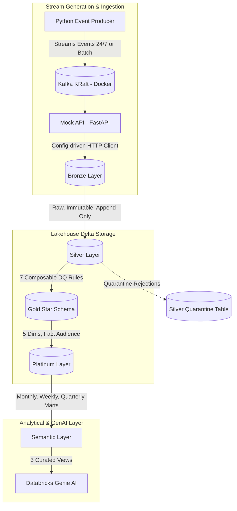

<h1 align="center">Real-Time Media Analytics Lakehouse & GenAI Assistant</h1>

<p align="center">
  
  
  
  
  
  
</p>

<p align="center">
  <strong>A generalized, end-to-end streaming analytics lakehouse architecture with natural language querying capabilities via Databricks Genie.</strong>
</p>

---

## 📖 Project Context

This portfolio project simulates a production-grade streaming analytics lakehouse for media audience measurements. It processes high-throughput audience events through a 6-layer Delta Lake architecture and exposes a curated semantic layer optimized for Natural Language-to-SQL querying using **Databricks Genie**.

**Note:** This project uses a fully synthetic, generalized data source and is *not* tied to any specific client, company, or proprietary dataset.

---

## 🏛️ Architecture & Data Pipeline

The architecture consists of an end-to-end streaming and batch pipeline across 6 logical layers:



---

## 🔬 Layer Specifications & Engineering Decisions

<details>
<summary><strong>🥉 Bronze Layer (Raw Ingestion)</strong></summary>

- **Purpose:** Lands raw event payloads fetched from the FastAPI mock analytics endpoint.
- **Key Decision:** **Strictly Immutable & Append-Only**. Never mutated or overwritten. Serves as the immutable audit log for raw API data.
</details>

<details>
<summary><strong>🥈 Silver Layer (Data Quality & Quarantine)</strong></summary>

- **Purpose:** Standardizes, casts, normalizes, and validates incoming data.
- **Key Decision:** Implements 7 composable Data Quality (DQ) rules. Invalid records are automatically isolated into `silver.audience_quarantine` with specific reason codes instead of failing the pipeline.
- **Grain:** `property_id` × `event_date` × `platform` × `geography_id`
- **7 DQ Rules:**
  1. **Missing Values:** Hard-drop missing `property_id`/`event_date`; soft-log missing `geography_id`.
  2. **Deduplication:** Deduplicate on natural key (`property_id`, `event_date`, `platform`, `geography_id`).
  3. **Invalid Values:** Hard-drop negative `audience_value`.
  4. **Value Standardization:** Normalize casing/whitespace on platform/category; validate against allowed enums.
  5. **Type Casting:** Explicit date/timestamp casting; fail loudly on cast failures.
  6. **Referential Integrity:** Enforce `property_id` existence in `dim_property`.
  7. **Anomalous Spike Detection:** Soft-log rows where `audience_value` > 5x rolling 7-day median.
</details>

<details>
<summary><strong>🥇 Gold Layer (Star Schema)</strong></summary>

- **Purpose:** Dimensional modeling for ad-hoc SQL analytics and reporting.
- **Components:** 5 dimension tables (`dim_property`, `dim_geography`, `dim_platform`, `dim_category`, `dim_date`) + 1 central `fact_audience` table.
- **Grain:** `property_id` × `event_date` × `platform` × `geography_id`
</details>

<details>
<summary><strong>💎 Platinum Layer (Multi-Period Analytical Marts)</strong></summary>

- **Purpose:** Highly optimized pre-aggregations supporting multi-period reporting.
- **Components:** `mart_audience_rankings` & `mart_audience_profile`.
- **Pre-Aggregated Periods:** **`MONTHLY`**, **`WEEKLY`**, and **`QUARTERLY`** (`2026-Q1`, `2026-Q2`, etc.) stored in the same mart tables for unified querying.
</details>

<details>
<summary><strong>🤖 Semantic Layer & Databricks Genie</strong></summary>

- **Purpose:** Optimized surface area for Natural Language-to-SQL generation.
- **Key Decision:** Restricted surface area consisting of **3 curated views ONLY**:
  - `sem_audience_rankings` (Rankings, market share, top properties)
  - `sem_audience_profile` (Property composition breakdown by platform & region)
  - `sem_cross_property_comparison` (Head-to-head audience index comparisons)
</details>

---

## ⚡ Data Generator & Ingestion Modes

The synthetic event generator ([`generator/synthetic_event_producer.py`](file:///c:/Abhay%20Folder/Real-Time-Media-Analytics-Lakehouse/generator/synthetic_event_producer.py)) supports multiple production modes:

```bash
# 1. Continuous 24/7 Live Stream (Fresh Daily Records)
uv run python -m generator.synthetic_event_producer --env dev --continuous --batch-size 5000

# 2. Multi-Quarter Historical Batch (e.g. 10,000 events across past 365 days)
uv run python -m generator.synthetic_event_producer --env dev --batch-size 10000 --once

# 3. Timed Streaming Run (e.g. 5,000 events over 30 minutes)
uv run python -m generator.synthetic_event_producer --env dev --batch-size 5000 --duration-minutes 30
```

---

## 🤖 Databricks Workflow & Schedule

The Databricks Workflow ([`resources/workflows.yml`](file:///c:/Abhay%20Folder/Real-Time-Media-Analytics-Lakehouse/resources/workflows.yml)) orchestrates 4 tasks (`ingest` → `silver` → `gold` → `platinum`):

- **Schedule:** Recurring **every 3 hours** (`quartz_cron_expression: "0 0 */3 * * ?"`).
- **Fault Tolerance:** 2x task retries with automatic backoff + email notifications on failure.
- **Idempotency:** All Gold & Platinum writes use idempotent overwrites so re-running the job never creates duplicate records.

---

## 🧪 Testing & Validation Harness

- **PySpark Test Suite:** 29 local unit/integration tests + 8 dedicated Silver DQ proof-tests (`pytest`).
- **Genie Validation Harness:** Automated 25-question test suite ([`validation/genie_validator.py`](file:///c:/Abhay%20Folder/Real-Time-Media-Analytics-Lakehouse/validation/genie_validator.py)) that executes natural language queries against Databricks Genie REST API and tracks accuracy trends in [`validation/accuracy_log.csv`](file:///c:/Abhay%20Folder/Real-Time-Media-Analytics-Lakehouse/validation/accuracy_log.csv).
- **Live Verification Status:** **`100.0% PASS`** on Databricks Genie Space (`01f1a1fd42bf12c9b418f72e196ce123`).

---

## ⚠️ Limitations & Notes

- Databricks Genie validation requires a live Unity Catalog workspace and SQL Warehouse.
- Spike Detection DQ Rule (Rule #7) requires ≥7 days of prior data for rolling median computation.
- Cross-property comparison view size grows quadratically with the number of unique properties compared.

---

*Built by Abhay Aman Pandey*
