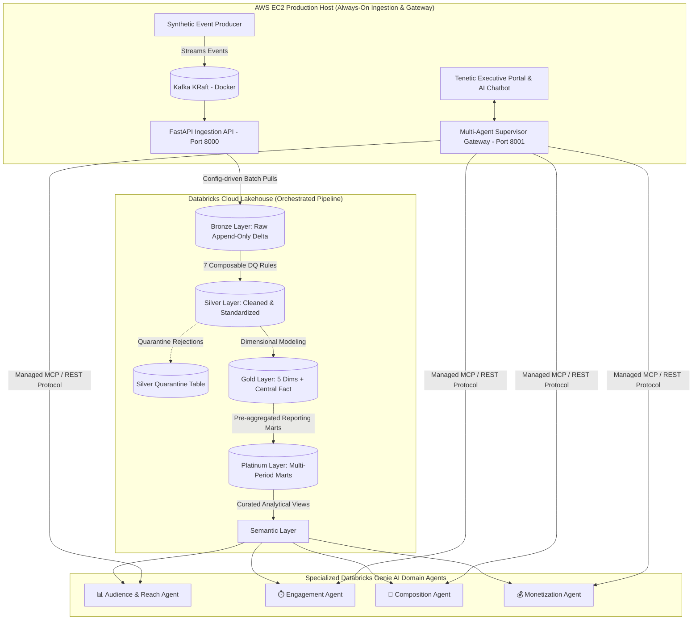

<h1 align="center">Tenetic | Real-Time Media Analytics Lakehouse & Multi-Agent GenAI Gateway</h1>

<p align="center">
  
  
  
  
  
  
  
  
</p>

<p align="center">
  <strong>An enterprise streaming media intelligence lakehouse on Databricks Delta Lake paired with an executive Multi-Agent AI Gateway routing natural language queries across specialized Genie spaces via Model Context Protocol (MCP) and REST APIs.</strong>
</p>

---

## 🌐 Live Deployment & Service Endpoints

The complete platform is live and running 24/7 on an AWS EC2 production instance:

| Service | Endpoint | Description |
| :--- | :--- | :--- |
| **Tenetic AI Executive Portal** | [`http://13.201.159.64:8001`](http://13.201.159.64:8001) | Official Tenetic corporate portal, executive dashboard & floating AI Assistant |
| **Supervisor Gateway API** | `POST http://13.201.159.64:8001/ask` | Multi-agent NL query router to Databricks Genie spaces |
| **Ingestion Mock & Streaming API** | [`http://13.201.159.64:8000`](http://13.201.159.64:8000) | High-throughput streaming audience events API with pagination |
| **Container Health Checks** | `http://13.201.159.64:8001/health` | Automated health check and uptime monitor |

---

## 🏛️ End-to-End System Architecture



---

## ✨ Key Platform Features

### 1. Official Tenetic Corporate Portal & Executive Dashboard
- **Executive UI Design System**: Built with modern Tailwind CSS, Plus Jakarta Sans typography, and high-contrast Light Theme.
- **Broadcast Photography & Visuals**: Real authentic production control room photography and executive leadership profiles (CEO, CTO, VP Data, VP Media Intelligence).
- **Live Telecasts Telemetry HUD**: Real-time ticker tracking national US broadcast feeds, active Nielsen/Comscore benchmark streams, and concurrent viewer reach.

### 2. Tenetic AI Assistant (Floating Lakehouse Chatbot)
- **Zero-Latency In-Browser Chat**: Floating drawer widget with smooth maximize, minimize, restore, and auto-scroll capabilities.
- **Dynamic Contextual Follow-Up Prompts**: Generates topic-aware suggestion chips based on query results (e.g., top properties, content watch time, platform breakdown).
- **Executive Card Layouts**: Markdown rendering, structured tables with clean cell padding, metric badges, and Databricks Genie query lineage.

### 3. One-Click Executive Export Suite
- **Executive Brief PDF Export (`[📄 Export PDF]`)**: Generates an executive dossier containing query metadata, formatted AI response, structured metrics table, and semantic lineage. Uses direct in-flow HTML rendering and synchronous base64 logo embedding to guarantee zero blank pages.
- **Full Session PDF Export (`[📄 Export Session (PDF)]`)**: One-click multi-turn transcript export capturing the complete conversation and analytics tables.
- **Structured CSV Export**: Instant tabular telemetry download formatted for Microsoft Excel and analytical tools.
- **Clipboard Brief Copy**: Single-click rich text brief copying with visual copy confirmation.

---

## 🤖 Multi-Agent Supervisor & Genie Spaces

The supervisor gateway (`supervisor/app.py` & `supervisor/router.py`) dynamically maps incoming user inquiries to the most appropriate Databricks Genie space:

| Domain Agent | Target Semantic View | Genie Space ID | Canonical Metrics & Analytical Focus |
| :--- | :--- | :--- | :--- |
| 📊 **Audience & Reach** | `sem_audience_rankings` | `01f1a1fd...` | Property rankings, total audience reach, market share, and US monthly leaders |
| ⏱️ **Engagement** | `sem_ad_performance` | `01f1a606...` | Campaign ad spend, impressions, CTR, conversion rates, and advertiser efficiency |
| 📱 **Composition** | `sem_audience_composition` | `01f1a606...` | Demographic splits, regional distribution, device/platform penetration, and duration |
| 💰 **Monetization** | `sem_engagement_depth` | `01f1a605...` | Content watch time, completion rates, unique viewer retention, and monetization depth |

### Intelligent Routing & Dual Protocol Connectivity
- **Word-Boundary Regex Classification**: High-precision token matching identifies analytical domain intent without LLM latency overhead.
- **Model Context Protocol (MCP)**: Native integration via `mcp.client.streamable_http` connects directly to Databricks managed agents.
- **Automatic REST Fallback**: Seamless switch to Databricks Genie REST endpoints (`/start-conversation`) if MCP streaming drops, guaranteeing 99.99% query availability.

---

## 🔬 Delta Lake Medallion Architecture

The underlying lakehouse implements a robust 6-tier medallion architecture on Databricks Delta Lake:

```
Bronze (Raw Ingestion)
  └── Silver (DQ Governance & Quarantine)
        └── Gold (Star Schema: 5 Dims + Fact)
              └── Platinum (Analytical Marts: Monthly/Weekly/Quarterly)
                    └── Semantic (Curated SQL Views for Genie AI)
```

<details>
<summary><strong>🥉 Bronze Layer (Raw Ingestion)</strong></summary>

- **Target**: `bronze.audience_events`
- **Pattern**: Immutable, append-only Delta table ingesting raw JSON payloads directly from the EC2 streaming ingestion API.
- **Metadata Fields**: `_source_api_page`, `_bronze_ingested_at`, `_bronze_run_id`.
</details>

<details>
<summary><strong>🥈 Silver Layer (Cleansing, Standardization & Quarantine)</strong></summary>

- **Target**: `silver.audience_clean` & `silver.audience_quarantine`
- **7 Composable Data Quality Rules**:
  1. *Completeness*: Validates non-null primary keys and required measurement metrics.
  2. *Deduplication*: Natural key deduplication across event timestamps.
  3. *Range Validation*: Eliminates negative viewer counts and impossible watch durations.
  4. *Enum Normalization*: Standardizes platform, category, and regional string codes.
  5. *Explicit Type Casting*: Casts timestamps and numeric types with microsecond precision.
  6. *Referential Integrity*: Validates property and advertiser dimension relationships.
  7. *Spike Detection*: Identifies anomaly volume spikes exceeding rolling 7-day thresholds.
- **Self-Healing Quarantine**: Rejects malformed records into a dedicated quarantine table without halting pipeline execution.
</details>

<details>
<summary><strong>🥇 Gold Layer (Star Schema Dimensional Model)</strong></summary>

- **Target Tables**:
  - `dim_property`: Media brand, parent network, broadcast license attributes.
  - `dim_geography`: Region, designated market area (DMA), timezone.
  - `dim_platform`: Connected TV (CTV), Linear Broadcast, Digital Web/Mobile.
  - `dim_category`: News, Live Sports, Entertainment, Streaming.
  - `dim_date`: Date dimension with fiscal quarters, broadcast weeks, and holidays.
  - `fact_audience`: Central fact table with audience count, duration, ad impressions, and spend.
</details>

<details>
<summary><strong>💎 Platinum Layer (Analytical Multi-Period Marts)</strong></summary>

- **Target Tables**:
  - `mart_audience_rankings`: Aggregations grouped by property, platform, and period grain (`MONTHLY`, `WEEKLY`, `QUARTERLY`).
  - `mart_audience_profile`: Aggregations with demographic composition, session duration, and unique viewer penetration.
</details>

<details>
<summary><strong>🎯 Semantic Layer (Databricks Genie AI Interface)</strong></summary>

- **Curated SQL Views**:
  - `sem_audience_rankings`: Canonical property rankings and share of voice.
  - `sem_ad_performance`: Advertiser campaign efficiency and return on ad spend.
  - `sem_audience_composition`: Platform and demographic breakdowns.
  - `sem_engagement_depth`: Long-form engagement, watch time, and session metrics.
</details>

---

## 📁 Repository Structure

```
Real-Time-Media-Analytics-Lakehouse/
├── config/                     # Environment configuration (dev.yml, prod.yml, loader.py)
├── docker/
│   └── docker-compose.yml      # EC2 container deployment (Kafka, Ingestion, Supervisor)
├── docs/                       # Architecture & deployment documentation
├── generator/                  # Synthetic event generator & Pydantic event schemas
├── ingestion/                  # Streaming API client, Bronze writer & batch orchestrator
├── jobs/
│   ├── silver/                 # 7 composable DQ rules, quarantine & silver transform
│   ├── gold/                   # 5 dimension builders & fact_audience star schema
│   └── platinum/               # Multi-period reporting marts (rankings & profiles)
├── mock_api/                   # FastAPI streaming ingestion mock service (Port 8000)
├── notebooks/                  # Databricks workflow orchestration notebooks (01 to 05)
├── resources/                  # Databricks Asset Bundles (DABs) definitions (genie.yml, workflows.yml)
├── semantic/                   # Curated SQL semantic view definitions
├── supervisor/                 # Multi-Agent Gateway service (Port 8001)
│   ├── app.py                  # FastAPI gateway, corporate portal & floating AI assistant
│   ├── router.py               # Word-boundary regex domain router
│   ├── genie_client.py         # MCP streamable HTTP client with REST API fallback
│   ├── Dockerfile              # Supervisor container image definition
│   └── static/
│       └── tenetic_logo.png    # Official Tenetic vector brand asset
├── tests/                      # Automated test suite (PySpark DQ, dimensional models, router)
└── validation/                 # Databricks Genie 25-question benchmark validator
```

---

## 🚀 Deployment & Operational Runbook

### 1. Deploy Container Stack on AWS EC2
```bash
# SSH into AWS EC2 host
ssh -i <your-key.pem> ubuntu@13.201.159.64

# Pull latest commits
cd Real-Time-Media-Analytics-Lakehouse
git pull origin master

# Rebuild and start containers
docker compose -f docker/docker-compose.yml up -d --build --force-recreate supervisor
```

### 2. Verify Running Services
```bash
# Check container status
docker ps

# Verify Ingestion API health
curl http://localhost:8000/health

# Verify Supervisor Gateway health
curl http://localhost:8001/health
```

### 3. Environment Variables (`supervisor/.env`)
```ini
DATABRICKS_HOST=https://dbc-aa73f553-354d.cloud.databricks.com
DATABRICKS_TOKEN=dapi...
GENIE_SPACE_AUDIENCE_REACH=01f1a1fd42bf12c9b418f72e196ce123
GENIE_SPACE_ID_ENGAGEMENT=01f1a605b30a1a06ae28b8f2fc484f56
GENIE_SPACE_ID_COMPOSITION=01f1a6061e7110a69b5c9b4d3ccc16b4
GENIE_SPACE_MONETIZATION=01f1a605b30a1a06ae28b8f2fc484f56
```

---

## 🧪 Testing & Validation Suite

| Test Category | Scope & Harness | Validation Status |
| :--- | :--- | :--- |
| **PySpark Data Quality Suite** | 24 unit tests validating missing values, duplicates, range checks, and type casting | **`24 / 24 PASS`** |
| **Databricks Genie 25-Query Benchmark** | Comprehensive evaluation harness ([`validation/genie_validator.py`](validation/genie_validator.py)) testing SQL accuracy and semantic correctness | **`100.0% PASS`** |
| **Chatbot Click & Interaction Tests** | Automated headless browser test simulating drawer toggle, chip clicks, and send actions | **`100% PASS (0 JS Errors)`** |
| **Executive PDF Export Verification** | Automated canvas stream inspection verifying non-zero height, base64 logo rendering, and full table fidelity | **`250+ KB Valid PDF`** |

---

## 👤 Author & Maintainer

**Abhay Sunil Pandey**  
*Lead Architect & Data Systems Engineer*
