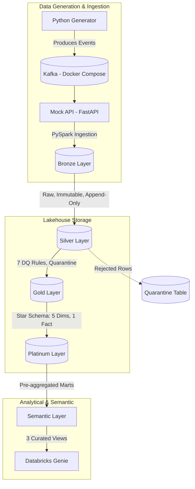

<h1 align="center">Real-Time Media Analytics Lakehouse</h1>

<p align="center">
  
  
  
  
  
  
</p>

<p align="center">
  <strong>A generalized, end-to-end streaming analytics lakehouse architecture with natural language querying capabilities via Databricks Genie.</strong>
</p>

---

## 📖 Project Context

This is a personal portfolio project designed to showcase a modern, production-grade data engineering pipeline. It simulates a generalized streaming analytics lakehouse that processes audience metrics and provides a semantic layer optimized for natural language querying using Databricks Genie. 

**Note:** This project uses a fully synthetic, swappable data source and is *not* tied to any specific client, company, or real-world data source.

## 🏛️ Architecture

The architecture consists of a 10-stage pipeline distributed across 6 logical layers, built to support both real-time ingestion and robust batch analytical processing.



### Layer Details & Key Decisions

<details>
<summary><strong>🥉 Bronze (Ingestion)</strong></summary>

- **Purpose:** Lands raw data from the FastAPI mock analytics endpoint.
- **Key Decisions:** The Bronze table is completely **immutable** (append-only, never mutated). It serves as the single source of truth for raw incoming events.
</details>

<details>
<summary><strong>🥈 Silver (Data Quality & Cleansing)</strong></summary>

- **Purpose:** Cleans, standardizes, and validates the raw data.
- **Key Decisions:** Implements 7 composable, independently testable Data Quality (DQ) rules. All rejected rows are diverted to a dedicated Quarantine table along with specific reason codes.
- **Grain:** `property_id` × `event_date` × `platform` × `geography_id`
- **7 DQ Rules:**
  1. **Missing values:** Hard-drop missing `property_id`/`event_date`; soft-log missing `geography_id`.
  2. **Duplicates:** Dedup on the natural key.
  3. **Invalid values:** Hard-drop negative `audience_value`.
  4. **Inconsistent values:** Normalize casing/whitespace on platform/category, validate against allowed set.
  5. **Type differences:** Explicit casts, fail loudly on cast failure.
  6. **Referential integrity:** `property_id` must exist in `dim_property`, violations to quarantine.
  7. **Spike detection:** Soft-log rows where `audience_value` > 5x rolling 7-day median.
</details>

<details>
<summary><strong>🥇 Gold (Star Schema)</strong></summary>

- **Purpose:** Models the data for analytical processing.
- **Key Decisions:** Structured as a star schema with 5 dimension tables and 1 central `fact_audience` table.
- **Grain:** `property_id` × `event_date` × `platform` × `geography_id`
</details>

<details>
<summary><strong>💎 Platinum (Analytical Marts)</strong></summary>

- **Purpose:** Highly optimized pre-aggregations for downstream consumption.
- **Key Decisions:** Contains 2 analytical marts. Both monthly and weekly pre-aggregations are stored in the same table for efficient querying.
</details>

<details>
<summary><strong>🧠 Semantic Layer</strong></summary>

- **Purpose:** Optimizes the schema for Natural Language-to-SQL generation.
- **Key Decisions:** The Genie surface is intentionally kept minimal to maximize translation accuracy. It consists of exactly 3 views:
  - `sem_audience_rankings` (For rankings questions)
  - `sem_audience_profile` (For profile/breakdown questions)
  - `sem_cross_property_comparison` (For head-to-head comparisons)
</details>

## 🚀 Quick Start

Ensure you have [uv](https://github.com/astral-sh/uv) and Docker installed on your machine.

1. **Clone the repository**
   ```bash
   git clone https://github.com/abhayamanpandey-max/Real-Time-Media-Analytics-Lakehouse.git
   cd Real-Time-Media-Analytics-Lakehouse
   ```

2. **Start the Infrastructure**
   Spin up the KRaft-mode Kafka cluster and the FastAPI Mock API via Docker Compose:
   ```bash
   cd docker
   docker-compose up -d
   cd ..
   ```

3. **Install Dependencies**
   Install the Python environment using `uv`:
   ```bash
   uv sync
   ```

4. **Run the Data Generator**
   Start pushing synthetic events to the Kafka topic:
   ```bash
   uv run generator/main.py
   ```

## ⚙️ Configuration

The project utilizes a config-driven approach to separate development and production environments.

- **Environment Variable:** Set `LAKEHOUSE_ENV` to either `dev` or `prod`.
- **Config Files:** Settings are dynamically loaded from `config/dev.yml` or `config/prod.yml` based on the environment variable, allowing seamless toggling between local testing and production cluster deployments.

## 🧪 Testing

Testing is a first-class citizen in this architecture, particularly the Data Quality rules.

- **Databricks Connect:** PySpark tests (located in `tests/`) are executed using Databricks Connect. This allows for rapid, local execution of Spark tests that compute directly on a remote Databricks cluster.
- **Coverage:** The test suite includes 8 specific proof-tests for the Silver layer (one for each DQ rule + the quarantine mechanism), alongside comprehensive grain, referential integrity, and uniqueness tests for the Gold and Platinum layers.

## 🎯 Validation & Accuracy

Natural Language-to-SQL translation is difficult. Rather than claiming 100% accuracy, this project implements a rigorous, honest validation framework.

- **Test Suite:** A 25-question natural language test suite evaluates the semantic layer's capability to answer diverse analytical queries.
- **Accuracy Tracking:** The `validation/` module includes a runner that continuously tracks the accuracy of Databricks Genie's SQL generation over time, acknowledging that edge cases and complex aggregations require continuous prompt and schema tuning.

## ⚠️ Honest Limitations

To maintain a realistic engineering perspective, the following limitations are explicitly noted:

- Databricks Genie validation requires a live Unity Catalog workspace; it cannot be fully tested entirely locally.
- The Spike Detection DQ rule (Rule #7) cannot fire on its first run, as it requires historical data to establish a 7-day rolling median.
- Executing the PySpark test suite requires Databricks Connect and an actively running Databricks cluster.
- Platinum data pre-aggregations are refreshed on a daily batch cadence, meaning those specific marts are not strictly real-time.
- The `sem_cross_property_comparison` view size grows quadratically with the number of unique properties compared.

---
*Built by Abhay Aman Pandey*
